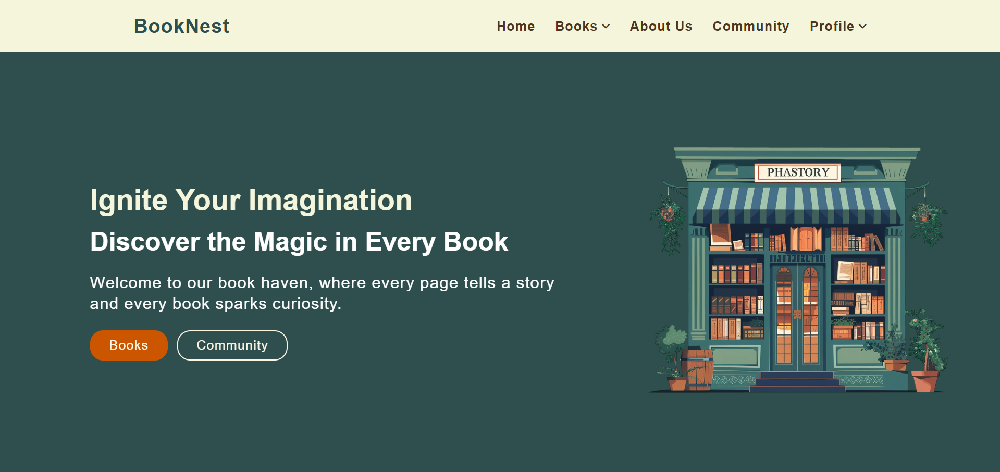

# 📚 Bookstore Website

Welcome to my Bookstore Website project! This is an ongoing project aimed at creating a fully functional online bookstore. Currently, the site is in development and not yet responsive. Future plans include integrating a book API to dynamically populate the books page.

---

## 📸 Screenshot

---

## 📄 Project Overview

### Pages:
- **Home Page** – Welcome screen with animations.
- **Books Page** – Showcase of available books (Planned API Integration).
- **Community Page** – A space for readers to engage and share.
- **About Us Page** – Information about the bookstore and its creators.
- **Login/Sign Up Page** – User authentication system.

---

## 🛠️ Technologies Used
- **HTML** – Structure and layout.
- **CSS** – Styling and design.
- **JavaScript** – Animations and interactivity.

---

## 🚧 Current Status
- The project is **paused** for now.
- Plans to work on:
  - Making the website responsive.
  - Adding dynamic book content using **Book API**.

---

## 🔄 Future Improvements
- Full mobile responsiveness.
- User reviews and book ratings.
- Cart and checkout system.

---
